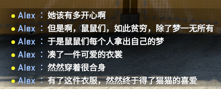
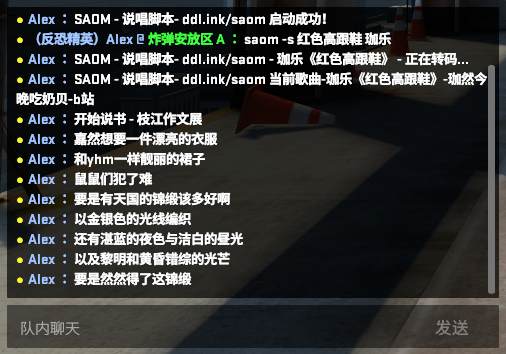

# 说唱脚本

> 一个神奇的说唱脚本。

## 概述

灵感来自[SLAM](https://github.com/SilentSys/SLAM)。

SAOM 可以帮你快速在游戏中点歌、说书。不同于[SLAM](https://github.com/SilentSys/SLAM)的地方是它不用在游戏和点歌程序中切来切去。如果您想点歌，可以直接在游戏内打字即可。

## 特性

- [x] 点歌
- [x] 说书
- [x] 自定义按键绑定
- [x] 友好的插件开发
- [ ] 权限管理

## 快速开始

可以通过[Releases](https://github.com/xizeyoupan/SAOM/releases)下载打包好的程序。  
接着运行`第一次运行点这里.exe`，这会下载ffmpeg来支援转码。

也可以克隆此项目用python运行。

> 如果您选择python，最低版本要求3.9！

启动SAOM.exe（用python的话启动main.py），默认独轮车选择枝江作文展。启动csgo，进入游戏对局。打开csgo控制台，输入`exec saom`，回车。

> 千万不要忘了这一步！

接下来按`L`，你应该看到如下画面：

> L在这里是用来显示SAOM程序运行信息的键。

好了，现在来试试点歌：
输入搜歌指令`saom s 歌名`，按L显示提示信息，待下载转码完成后按N播放。

https://user-images.githubusercontent.com/44920131/152787546-d450918f-8229-4de6-8fb1-102339c58a28.mp4

如果看不到视频，点[这里](https://www.bilibili.com/video/BV1za41127VK)。

不断按P看看说书是怎么说的：

然后返回程序界面，点击停止。再次点按P和L，应该不会有输出，证明程序已关闭。

查看[文档](saom.vercel.app)来获得更多进阶用法。