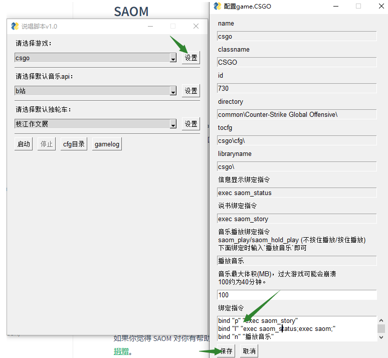

## 快速开始

可以通过[Releases](https://github.com/xizeyoupan/SAOM/releases)下载打包好的程序。  
接着运行`第一次运行点这里.exe`，这会下载ffmpeg来支援转码。

## 进行插件和绑定设置



运行`SAOM.exe`，设置csgo游戏，在绑定指令输入框中输入以下指令：

!> 运行以下指令后如果你的N、P或L键绑定过其他指令（如跳投），其他指令会被**覆盖**。解决方法请看[进阶用法]()。

!> 需要使用英文标点符号。

```plaintext
bind "p" "exec saom_story"
bind "l" "exec saom_status"
bind "n" "播放音乐"
```

接着点保存，启动。

## 开始食用
启动csgo，进入游戏对局。打开csgo控制台，输入`exec saom`，回车。

> 千万不要忘了这一步！

接下来按`L`，你应该看到如下画面：


?> L在这里是用来显示SAOM程序运行信息的键。

好了，现在来试试点歌：
输入搜歌指令`saom -s 歌名`，按L显示提示信息，待下载转码完成后按N播放。

?> N在这里是用来播放音乐的键。

<video controls width="80%">
    <source src="assets/quickstart/video.mkv" type="video/mp4">
</video>

不断按P看看说书是怎么说的：

?> P在这里是用来开独轮车的键。


然后返回程序界面，点击停止。再次点按P和L，应该不会有输出，证明程序已关闭。

> 即使程序关闭，按N仍会有音乐！

## 接下来

恭喜！你已经完成了基本用法。如果不想用N、P、L，更改[上一步](#进行插件和绑定设置)绑定指令中的N、P、L键为你自定义的键即可。如果想要更进一步，请看下一章节。