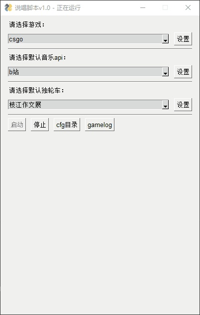
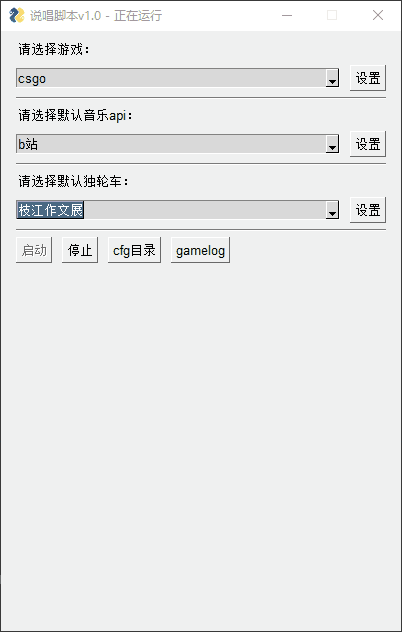
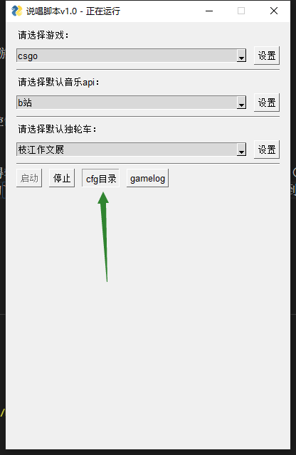
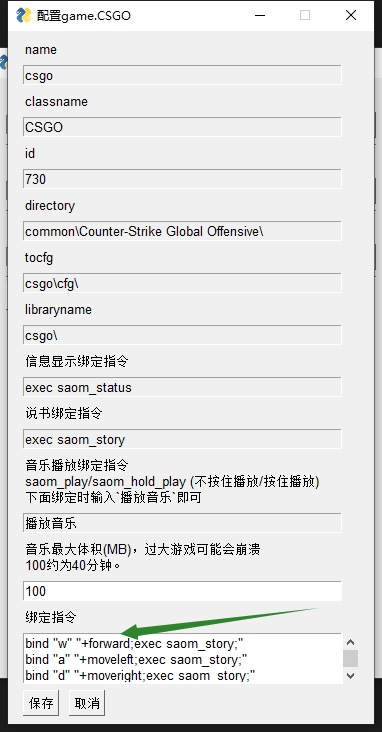

## 更改设置
当你启动程序，启动游戏并在控制台输入`exec saom`后，可以对各配置进行动态更改。比如在脚本运行当中想要换一个说书插件，只要选择即可。



这样就完成了插件的切换而**无需**在游戏内进行任何操作。同样的，每个插件的设置也都是立即生效的：



如上图就直接关闭了独轮车，**无需**在游戏内进行任何操作。

唯一例外的情况是下一章节：

!> 只有更改了*绑定指令*才需要在游戏控制台输入`exec saom`！

## 绑定指令
SAOM 的原理是通过游戏控制台指令来获得输入输出。一些特定的插件会暴露一些特定的指令（通常能在设置和插件文档中看到），譬如在游戏控制台输入`exec saom_status`，就会执行对应文件夹下的`saom_status.cfg`，点击`cfg`目录就很容易找到。



我们可以看到文件内是指令：

```
say "SAOM - 说唱脚本- ddl.ink/saom  启动成功！"
```

因此，我们可以绑定特定的按键来执行指令。而且，一个按键能够绑定的指令不止一个！试试输入以下这些：

```
bind "w" "+forward;exec saom_story;"
bind "a" "+moveleft;exec saom_story;"
bind "d" "+moveright;exec saom_story;"
bind "s" "+back;exec saom_story;"
```



保存后在游戏控制台输入`exec saom`，接着按方向键行走试试：


?> 这下真变独轮车了。

每次改变绑定指令后都要重新在游戏控制台输入`exec saom`太麻烦了，怎么办呢？直接把它和状态显示绑起来算了：在SAOM程序绑定指令框中加入一行，比如这样`bind "l" "exec saom_status;exec saom;"`，这下在游戏内都不用输入`exec saom`了，只要按L就相当于输入了`exec saom`。

绑定指令还有很多玩法。如果你不清楚你自己原来绑定的指令有哪些，可以下载一个叫[Everything](https://www.voidtools.com/zh-cn/)的软件，在软件中搜索`config.cfg`，打开文件就能看到你的绑定情况了。

几个绑定的注意点：
- 建议用双引号引住键和指令。
- 如果要将SAOM指令重复绑定到已有的键上，建议在后面添加指令。比如原来w键`bind "w" "+forward"`，想让w键也能说书，应该这么绑定：`bind "w" "+forward;exec saom_story;"`，而不是这样：`bind "w" "exec saom_story;+forward;"`。原因可以自己试试看。
- 绑定单个指令，不用加分号；绑定多个指令，必须在每个指令后面加上分号。注意多个指令的最后一条指令的分号别漏了！
- 一切标点用英文。
